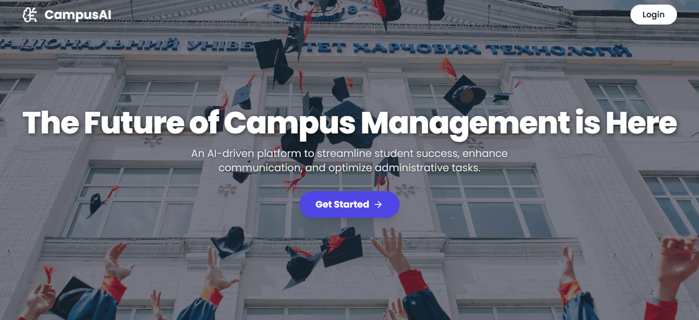
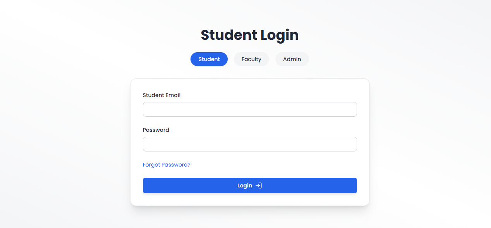
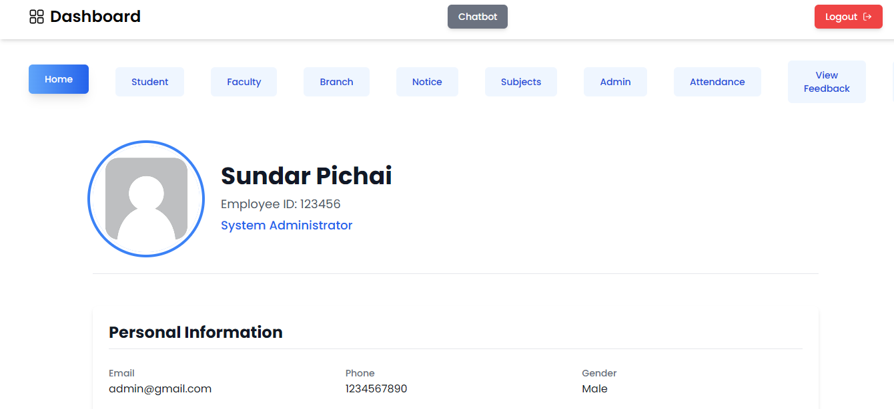
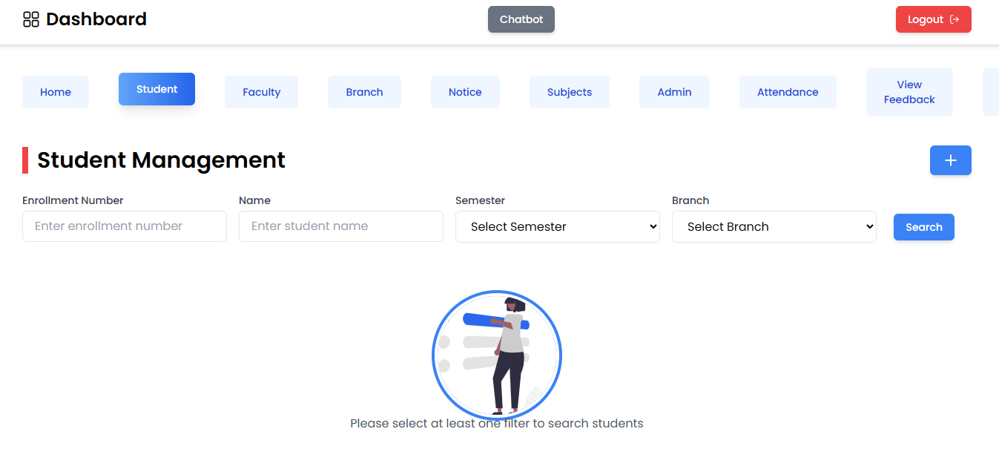

# 🧠 CampusAI – AI-Powered Student Portal

> A full-stack AI-powered web platform for students, faculty, and administrators that integrates intelligent features like attendance tracking, chatbot assistance, role-based dashboards, and academic automation.

## 📸 Project Preview





--- 

## 🚀 Features

- 🔐 Role-based login system for Student, Faculty & Admin
- 📊 Dashboard with attendance statistics & reports
- 📚 Assignment submission & viewing modules
- 🤖 Gemini-integrated AI Chatbot for academic queries
- 🧾 Admin panel for full user and content management
- 📦 MongoDB-based flexible data storage
- 🌐 RESTful API backend with Node.js + Express
- 💡 Responsive UI with React.js & Tailwind CSS

---

## 🧩 Tech Stack

- **Frontend**: React.js, Tailwind CSS, JavaScript
- **Backend**: Node.js, Express.js
- **Database**: MongoDB (Local/Cloud)
- **Authentication**: JWT
- **AI Integration**: Gemini API, NLP frameworks
- **Mail Services**: Nodemailer

---

## ⚙️ Installation Steps

Clone the repository:

```bash
git clone https://github.com/Ravishetty07/ResumeAI.git
cd ResumeAI
````

> ⚠️ Before proceeding, create your own `.env` file using the format below or copy from `.env.example`.

---

### 📦 Backend Setup

```bash
cd backend
npm install
npm install bcryptjs
npm run seed     # (Optional) Populate DB with dummy data
npm run dev      # Starts the server on PORT 4000 or specified
```

---

### 💻 Frontend Setup

```bash
cd ../frontend
npm install
npm install lucide-react
npm start
```

---

## 🔐 .env.example

```env
MONGODB_URI = mongodb://127.0.0.1:27017/College-Management-System
PORT = 4000
FRONTEND_API_LINK = http://localhost:3000
JWT_SECRET = THISISSECRET

GEMINI_API_KEY = 'your-gemini-api-key'

NODEMAILER_EMAIL = your-email@example.com
NODEMAILER_PASS = your-email-password
```

> ⚠️ Never upload your actual `.env` to the repository. Keep secrets safe!

---

## 🧠 AI Chatbot Module

* Handles natural language queries related to:

  * Attendance
  * Assignments
  * Deadlines
  * Timetables
* Uses NLP + Gemini to deliver intelligent contextual responses

---

## 📌 Limitations

* 🌐 Internet connection required
* 🔤 Single language (English) support
* 📱 No dedicated mobile app (yet)
* 📂 Initial admin data setup must be manual
* 🧠 Gemini-based chatbot handles only predefined academic queries

---

## 🔮 Future Enhancements

* 📲 Mobile app (Android & iOS)
* 🔔 Push Notifications
* 🧬 Biometric attendance system
* 🌐 Multi-language support
* ⛅ Cloud migration for large-scale deployment


---

## 👥 Team

* **Ravi M Shetty**
  [GitHub](https://github.com/Ravishetty07) | [Portfolio](https://ravishetty-portfolio.netlify.app)

